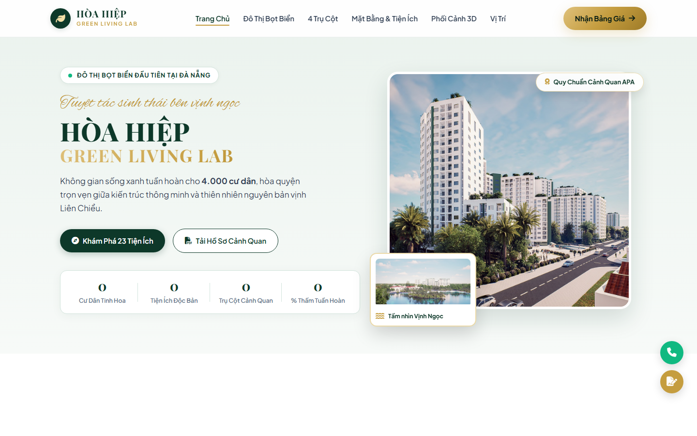

# HÒA HIỆP GREEN LIVING LAB — LANDING PAGE UI/UX

> **Đô thị sinh thái bọt biển tiên phong tại Tây Bắc Đà Nẵng (Hòa Hiệp Nam, Liên Chiểu)**  
> **Chủ Đầu Tư:** Tập đoàn Capital House  
> **Tư Vấn Thiết Kế Cảnh Quan:** APA Consultant Co., Ltd



---

## 🌿 Giới Thiệu Dự Án

**Hòa Hiệp Green Living Lab (Hòa Hiệp Sponge City)** là dự án tiên phong ứng dụng mô hình đô thị bọt biển tuần hoàn tại Liên Chiểu, Đà Nẵng. Dự án tích hợp các giải pháp cảnh quan thấm hút tự nhiên, tuần hoàn sinh thái và hạ nhiệt vi khí hậu, phục vụ cộng đồng cư dân tinh hoa với hơn 23+ tiện ích đặc quyền.

---

## ✨ Điểm Nhấn Thiết Kế & Trải Nghiệm (Luxury Real Estate UI/UX)

- **Bản sắc màu sắc:** Tone xanh ngọc bích / lục bảo (Emerald) chủ đạo kết hợp viền ánh kim Champagne Gold sang trọng.
- **Typography:** Sự kết hợp hài hòa giữa font có chân cổ điển `Playfair Display`, font chữ thảo nghệ thuật `Alex Brush` và font chữ không chân hiện đại `Plus Jakarta Sans`.
- **Hiệu ứng Parallax & Section Tối:** Phân khu Mặt bằng 23 Tiện ích & Vườn tầng mái nghỉ dưỡng được thể hiện trên nền tối huyền bí (`#061811`) với hiệu ứng Parallax rừng xanh chiều sâu.
- **Tương tác động mượt mà:**
  - Bộ lọc danh mục và trình xem ảnh phóng to (Lightbox Zoom) cho bộ sưu tập 3D Gallery.
  - Chuyển đổi tab 4 Trụ cột cảnh quan (Vitality Hub, Community, Mindfulness, Eco-Edu).
  - Bộ đếm chỉ số KPI tự động kích hoạt khi cuộn tới màn hình.
  - Form tư vấn đăng ký chuyên nghiệp với hiệu ứng thông báo Toast Notification.
  - Bản đồ vệ tinh quy hoạch Liên Chiểu với khung kính nổi sang trọng.

---

## 📂 Cấu Trúc Thư Mục

```text
├── index.html                  # Cấu trúc HTML5 ngữ nghĩa chuẩn SEO
├── style.css                   # Hệ thống Design System & CSS animations
├── script.js                   # Logic tương tác, Parallax, Lightbox, Filter & Toast
├── preview.png                 # Ảnh chụp giao diện thực tế
├── images/                     # Tài nguyên hình ảnh render 3D độ phân giải cao
│   ├── clean/                  # Renders công viên, hồ bơi resort, thể thao
│   ├── hero/                   # Phối cảnh tháp căn hộ, hồ cảnh quan, flycam
│   ├── location/               # Sơ đồ vệ tinh vị trí quy hoạch
│   └── ...                     # Các góc nhìn phối cảnh tiện ích
└── .github/workflows/deploy.yml# Tự động hóa Deploy lên GitHub Pages
```

---

## 🚀 Hướng Dẫn Chạy & Triển Khai

### 1. Mở trực tiếp trên máy cục bộ (Local)
Mở trực tiếp file `index.html` bằng bất kỳ trình duyệt nào (Chrome, Edge, Safari, Firefox) hoặc dùng Live Server:
```bash
# Hoặc dùng Python http server
python -m http.server 8000
```
Truy cập: `http://localhost:8000`

### 2. Triển khai lên GitHub Pages (Đã tích hợp sẵn)
Dự án được cấu hình sẵn GitHub Actions workflow tự động deploy lên GitHub Pages mỗi khi push code lên nhánh `main`.
- **Live URL:** `https://dev-trongphuc.github.io/Green-Living-Lab/`

---

## 📜 Bản Quyền
© 2026 HÒA HIỆP GREEN LIVING LAB. Bản quyền thuộc về Chủ Đầu Tư & Đơn vị Tư vấn APA.
